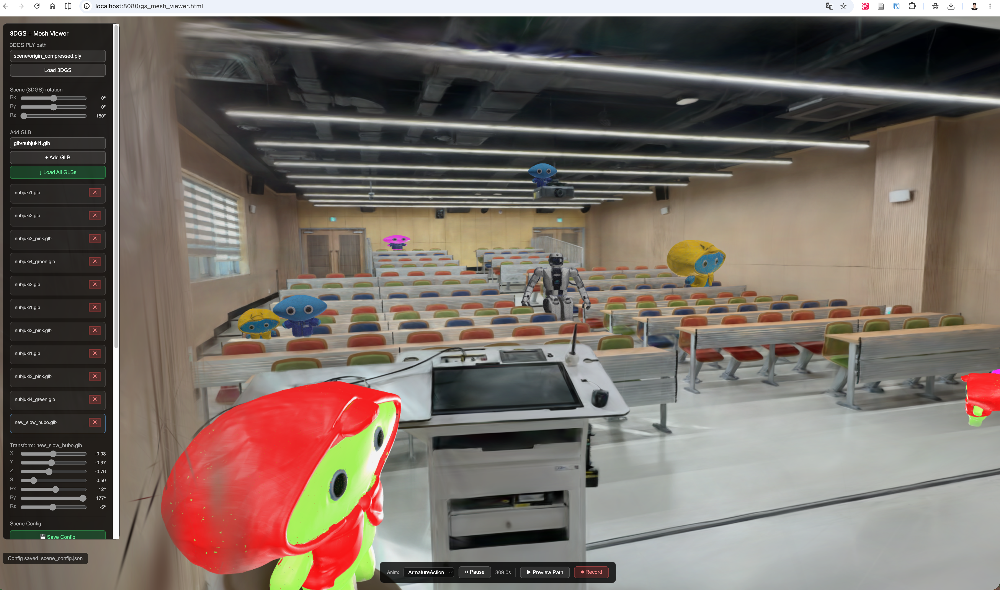

# CS479 3DML Rendering Contest — Team 15

## Hubo Joins the 3D Segmentation Contest!!!

---



## Overview

| Component | Description |
|---|---|
| **Scene** | Real-world classroom reconstructed via COLMAP + 3DGS |
| **Characters** | Animated GLB meshes generated by Hunyuan3D-2 |
| **Viewer** | Web-based renderer combining 3DGS scene + animated meshes |

---

## Repository Structure

```
CS479_3DML_Rendering_Contest/
├── Hunyuan3D/        # AI-based 3D character generation pipeline
└── gs_mesh_viewer/   # Web viewer for 3DGS + GLB rendering
```

---

## Details

- **3D Character Generation** → see [`Hunyuan3D/README.md`](./Hunyuan3D/team15_README.md)
- **Scene Reconstruction & Web Viewer** → see [`gs_mesh_viewer/README.md`](./gs_mesh_viewer/README.md)

---
